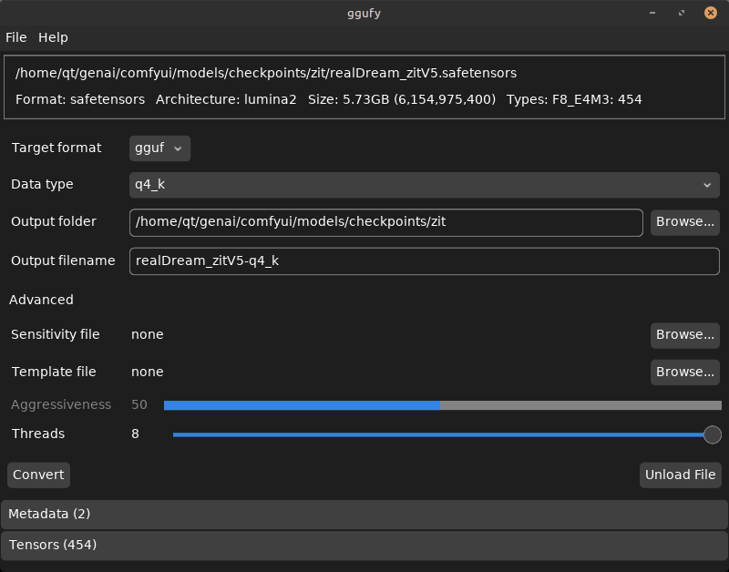
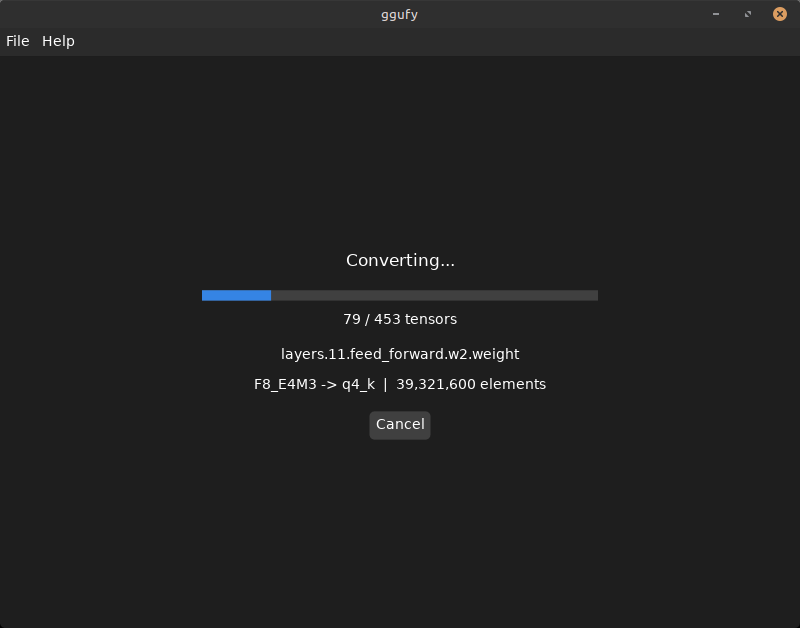

# ggufy
A lightweight and efficient tool to convert tensor formats.

ggufy:
- is a single-file executable written in zig, for linux, windows, and macos (arm64 and x86_64)
- comes in CLI and GUI flavors
- is fast and memory efficient
- supports converting from safetensors to various gguf quantizations
- supports converting safetensors datatypes (F32, BF16, F16, F8 E4M3/E5M2, Scaled F8 E4M3, MXFP8 E4M3, NVFP4, INT8, INT8 CONVROT)
- supports converting with "[quantization sensitivity](docs/CLI.md#sensitivity-aware-quantization)" files (some architectures built-in)
- currently targets image diffusion models (SD1.5, SDXL, etc.)

Download pre-built executables [on the releases page](https://github.com/qskousen/ggufy/releases)

### GUI screenshots

<p align="center">
  <a href="assets/ggufy-gui.png"></a>
  <a href="assets/ggufy-gui-converting.png"></a>
</p>

### AI-Assisted Disclaimer
As I have had limited time to work on side projects, more recently I have begun using AI to assist in writing code.
This is not a "vibe coded" program by the normal definition, but it is AI-assisted. Quality is carefully controlled and changes are reviewed before being merged.
After careful usage and consideration, it is my belief that the introduction of AI assistance has not decreased the quality of the code in the way I am using it.
However, I thought it best to add this disclaimer for transparency.

### Supported architectures

This table lists the architectures that ggufy can convert, and whether they have sensitivity data available.

| Architecture       | Supported | Sensitivity Data |
|--------------------|-----------|------------------|
| SD1.5              | ✅         | ✅                |
| SDXL               | ✅         | ✅                |
| Flux               | ✅         | ❌                |
| Lumina2 (ZiT, ZiB) | ✅         | ❌                |
| Aura               | ✅         | ❌                |
| HiDream            | ✅         | ❌                |
| Cosmos             | ✅         | ❌                |
| LTXV               | ✅         | ❌                |
| LTX2               | ✅         | ❌                |
| Hyvid              | ✅         | ❌                |
| WAN                | ✅         | ❌                |
| SD3                | ✅         | ❌                |
| Qwen               | ✅         | ❌                |
| ERNIE              | ✅         | ❌                |

I initially intended to have this all in pure zig, but now it includes ggml c/c++ code for quantization. I did actually get a working q8_0 implementation in zig (you can find it if you look back through the commits) but got stuck on figuring out q5_0 and decided to just pull in ggml and use that.

## Installation

### CLI

ggufy CLI is a single-file executable, available for download from the [releases page](https://github.com/qskousen/ggufy/releases).
Download the version appropriate for your system, extract it, and place it somewhere in your PATH; alternatively, run it directly from wherever you extracted it.

### GUI

ggufy is also available as a GUI app on the same [releases page](https://github.com/qskousen/ggufy/releases).
Download the version appropriate for your system, extract it, and run it.

## Usage

The primary use case for ggufy is converting models from safetensors to gguf format:

```bash
ggufy convert model.safetensors -d q4_k
```

There are three main ways to convert:
- using the `convert` command by itself,
- using the `template` command to generate a JSON template for a model and using it with `convert`,
- using the `convert` command with a sensitivity file to perform sensitivity-aware quantization.

For the full command reference — all commands and options, quantization levels, sensitivity-aware quantization, inspecting model files, and complete examples — see **[docs/CLI.md](docs/CLI.md)**.

## Building

ggufy is built with zig 0.16.0. Clone the repository, with submodules:

```bash
git clone --recurse-submodules https://github.com/qskousen/ggufy.git
```

Build with zig:
```bash
zig build
```

## Docker

ggufy can be built and run via Docker using the included `docker-compose.yml`.

### Building

```bash
docker compose build
```

### Running

Place input files in the `./input` directory and output files will be written to `./output`. Run ggufy with any arguments:

```bash
docker compose run --rm ggufy {args}
```

Where `{args}` are any ggufy command and options. For example:

```bash
# Convert a model to Q4_K
docker compose run --rm ggufy convert -d q4_k --output-dir /app/output /app/input/model.safetensors

# View file header
docker compose run --rm ggufy header /app/input/model.safetensors
```

## Acknowledgements

- [ggml](https://github.com/ggml-org/ggml) ggufy uses ggml for quantization
- [ComfyUI-GGUF by city96](https://github.com/city96/ComfyUI-GGUF) for helping me to understand a lot about how the quantization works, as well as architecture detection
- [llama.cpp.zig](https://github.com/Deins/llama.cpp.zig) for helping get ggml compiling in zig
- [gguf-docs](https://github.com/iuliaturc/gguf-docs) for helping me understand quantization
- Random German who helped to get ggufy working on MacOS for arm64 and x86_64
- [dvui](https://github.com/david-vanderson/dvui) ggufy GUI uses DVUI for cross-platform GUI
